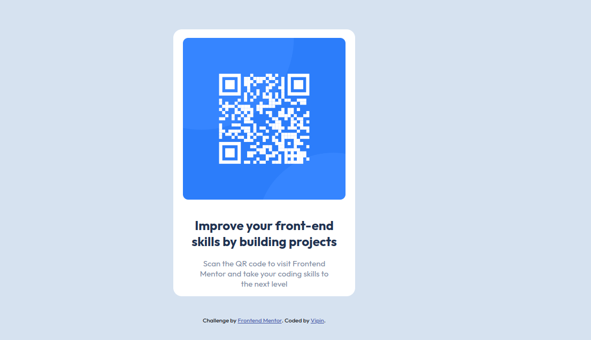

# Frontend Mentor - QR code component solution

This is a solution to the [QR code component challenge on Frontend Mentor](https://www.frontendmentor.io/challenges/qr-code-component-iux_sIO_H). Frontend Mentor challenges help you improve your coding skills by building realistic projects. 

### Screenshot

### Links

- Solution URL: [https://github.com/vipinsharmaa/qr-code-component-Frontend-mentor](https://github.com/vipinsharmaa/qr-code-component-Frontend-mentor)
- Live Site URL: [https://vipinsharmaa.github.io/qr-code-component-Frontend-mentor/](https://vipinsharmaa.github.io/qr-code-component-Frontend-mentor/)

## My process

### Built with

- Semantic HTML5 markup
- CSS custom properties
- Flexbox
- Mobile-first workflow

## Authors

- Website - [Vipin Sharma](https://www.your-site.com)
- Frontend Mentor - [@vipisharmaa](https://www.frontendmentor.io/profile/vipinsharmaa)
- Twitter - [@codecrash007](https://www.twitter.com/codecrash007)

